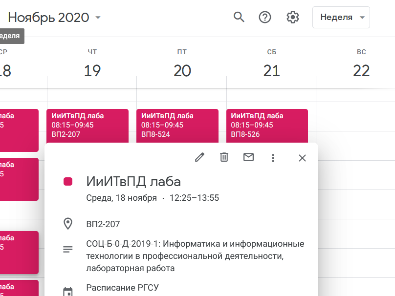
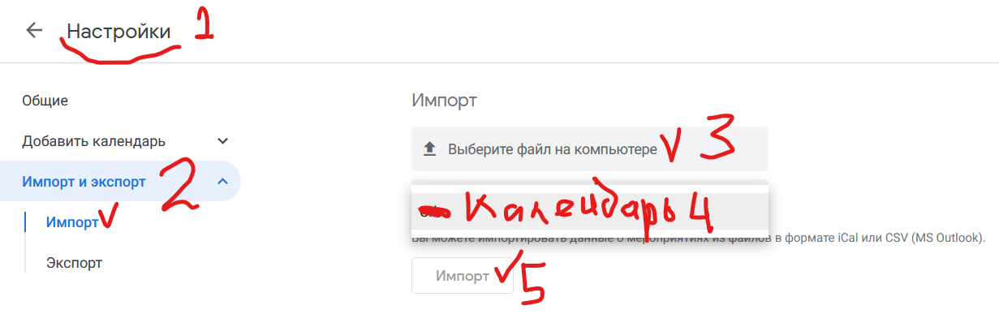

## Расписание преподавателя РГСУ

Скрипт парсит сайт rgsu.net, генерируя файл .csv с данными из расписания заданного преподавателя. 
Этот файл импортируется в Google календарь. Появляются события и напоминания о занятиях с названиями групп и аудиториями. 
Пользователи телефонов с Android получают календарь в своём устройстве.

Скрипт представлен в двух вариантах:
1. `rgsu_timetable.py` парсит общедоступное расписание с сайта rgsu.net для любого указанного преподавателя
2. `sdo_timetable.py` получает расписание из личного кабинета преподавателя в sdo.rgsu.net, поэтому в процессе 
своей работы он просит ввести логин и пароль от СДО (эти данные нигде не сохраняются и используются только в одном 
месте для авторизации на сайте)
 
Результаты их работы могут немного отличаться, так как расписания на rgsu.net и sdo.rgsu.net иногда не совпадают.
В частности, в sdo.rgsu.net внесены зачёты и экзамены. 
  

### Как пользоваться sdo_timetable:
1. Можно просто скачать `sdo_timetable.zip`, разархивировать и запустить программу. Она спросит для какой недели 
генерировать csv файл. Если для текущей, то `y` (yes), если для следующей - `n` (no, next). 
Далее вводите логин и пароль СДО и получаете csv файл с расписанием (см. п.6-7 ниже)
2. Либо скачиваете питоновский скрипт `sdo_timetable.py` и запускаете его на своём интерпретаторе Python (см. ниже)

### Как пользоваться rgsu_timetable:
1. Должен быть установлен интерпретатор Python версии 3.4 или выше 
2. Скорее всего, потребуется доустановить некоторые модули: `pip install -r requirements.ini`
3. Скачиваем `rgsu_timetable.py` в какую-либо директорию
4. Прописываем ФИО преподавателя, начальную и конечную даты в файле настроек `settings.txt`
5. Запускаем скрипт командой `python rgsu_timetable.py` в директории с скриптом
6. Появится файл `calendar_xx.xx.csv`
7. В Google каледнаре перейти в настройки (шестерёнка) -> Импорт и экспорт -> Выбрать csv файл и нужный календарь (см. скриншоты) -> Импорт

### Файл настроек для rgsu_timetable.py
В директории скрипта должен лежать файл с настройками `settings.txt` в кодировке UTF-8. Файл состоит из трёх строк - ФИО преподавателя **полностью** (как на сайте rgsu.net), начальная дата и конечная дата генерации расписания: 

> Фамилия Имя Отчество 
> dd.mm.yyyy 
> dd.mm.yyyy 

### Что добавлено:
Версия 1.4
* Скрипт парсинга расписания на sdo.rgsu.net
* Собранный исполняемый файл `sdo_timetable.exe` для запуска в Windows
* Небольшие правки

Версия 1.31
* Исправлено имя функции datetime
* Добавлен вывод информации об успешном завершении скрипта
* Добавлен файл `MakeTimetable.bat` для запуска в Windows скрипта без обращения к командной строке (просто кликнув этот файл)

Версия 1.3
* Для поточных занятий (несколько групп на одной паре) создаётся только одно событие в календаре. Объединение не происходит в случае не совпадения дисциплины или типа занятия (это ошибка в расписании на сайте)
* В диагностическом сообщении указывается чётность текущей недели с учём особенности отображения на сайте по воскресеньям
* Если что-то не так с файлом настроек, будет выводиться диагностика
* Вычисляется суммарная нагрузка преподавателя в часах в диапазоне, а также среднее количество часов в неделю для диапазона 

Версия 1.2
* ФИО и диапазон дат для генерации расписания считываются из файла настроек `settings.txt`
* Выделил диагностические сообщения. Однако они пока никак не используются и ни на что не влияют

Версия 1.11
* Расчёт расписания в этой версии происходит начиная с очередного понедельника
* Устранён небольшой баг при определении чётности недели

Версия 1.1
* Протестировал скрипт на расписаниях нескольких случайных преподавателей
* Устранены мелкие баги
* Изменён код генерации сокращённого названия дисциплины
* Добавлены скриншоты, демонстрирующие работу скрипта

Версия 1.0
* Версия протестирована пока только на моём расписании
* Ограничение: ФИО преподавателя и даты генерации записей в расписании прописываются непосредственно в питоновском скрипте
* Ограничение: даты занятий должны быть прописаны в поле Дисциплина. Скрипт пока не обрабатывает дисциплины, повторяющиеся весь семестр
* Ограничение: для поточных занятий скрипт генерит несколько событий, т.е. для каждой группы создаётся отдельное событие

### ToDo:
- [ ] Учесть случай дисциплины не по конкретным дням (весь семестр по чётным или нечётным неделям)
- [x] Объединить поточные занятия в одно событие
- [x] Добавить возможность передачи ФИО преподавателя через файл настроек
- [x] Добавить возможность задавать диапазон расчёта расписания через файл настроек
